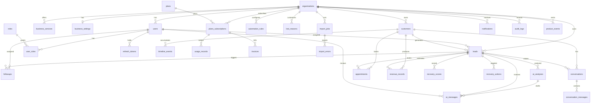

# RevenueRadar AI — Database Design

PostgreSQL 16. Migrations: Flyway (`V1__init.sql`, `V2__...`, forward-only).
All tenant-owned tables carry `organization_id UUID NOT NULL REFERENCES organizations(id)`.
All tables: `created_at TIMESTAMPTZ NOT NULL DEFAULT now()`, `updated_at TIMESTAMPTZ NOT NULL DEFAULT now()` where meaningful.
IDs: `UUID` (generated app-side or `gen_random_uuid()`).

**Storage convention:** all timestamps in **UTC** (`TIMESTAMPTZ`); display converts to org timezone (`Asia/Kolkata` default, stored per org).
**Money:** `NUMERIC(14,2)` + org-level `currency` (no FX conversion in MVP).

---

## 1. ER Diagram



---

## 2. Tables

### 2.1 Identity & tenancy

```sql
organizations (
  id UUID PK,
  name VARCHAR(160) NOT NULL,
  business_type VARCHAR(60) NOT NULL,        -- DENTAL_CLINIC, SALON, ... (configurable enum)
  currency CHAR(3) NOT NULL DEFAULT 'INR',
  timezone VARCHAR(60) NOT NULL DEFAULT 'Asia/Kolkata',
  working_hours JSONB,                        -- {"mon":[{"start":"09:00","end":"18:00"}], ...}
  avg_customer_value NUMERIC(14,2),
  sales_cycle_days INT,
  lead_sources TEXT[],                        -- ['Walk-in','Instagram','Google', ...]
  followup_preferences JSONB,                 -- {"defaultDueHours":24,"silentDays":14,...}
  status VARCHAR(20) NOT NULL DEFAULT 'ACTIVE',  -- ACTIVE,SUSPENDED,DELETED
  onboarded_at TIMESTAMPTZ,
  trial_ends_at TIMESTAMPTZ,
  deleted_at TIMESTAMPTZ
)

users (
  id UUID PK,
  organization_id UUID NULL FK organizations,   -- NULL = SUPER_ADMIN (platform user)
  email CITEXT UNIQUE NOT NULL,
  password_hash VARCHAR(100) NOT NULL,
  full_name VARCHAR(120) NOT NULL,
  phone VARCHAR(20),
  status VARCHAR(20) NOT NULL DEFAULT 'ACTIVE', -- ACTIVE,INVITED,DISABLED
  email_verified_at TIMESTAMPTZ,
  last_login_at TIMESTAMPTZ
)

roles (                    -- seeded, global
  id UUID PK,
  code VARCHAR(30) UNIQUE NOT NULL   -- SUPER_ADMIN,OWNER,MANAGER,EMPLOYEE
)

user_roles (
  user_id UUID FK,
  role_id UUID FK,
  PRIMARY KEY (user_id, role_id)
)

refresh_tokens (
  id UUID PK,
  user_id UUID FK,
  token_hash VARCHAR(64) NOT NULL UNIQUE,  -- sha256 of opaque token
  expires_at TIMESTAMPTZ NOT NULL,
  revoked_at TIMESTAMPTZ,
  replaced_by UUID FK refresh_tokens,
  created_ip VARCHAR(45)
)

password_reset_tokens (
  id UUID PK,
  user_id UUID FK,
  token_hash VARCHAR(64) NOT NULL,
  expires_at TIMESTAMPTZ NOT NULL,
  used_at TIMESTAMPTZ
)
```

### 2.2 Billing & usage

```sql
plans (                        -- seeded: TRIAL,STARTER,BUSINESS,PRO — price NOT in frontend
  id UUID PK,
  code VARCHAR(30) UNIQUE NOT NULL,
  name VARCHAR(60) NOT NULL,
  price_amount NUMERIC(12,2) NOT NULL,
  currency CHAR(3) NOT NULL DEFAULT 'INR',
  billing_interval VARCHAR(10) NOT NULL DEFAULT 'MONTHLY',
  trial_days INT NOT NULL DEFAULT 14,
  limits JSONB NOT NULL,       -- {"leads":500,"aiAnalyses":200,"messages":100,"users":3}
  features JSONB,              -- {"whatsapp":false,"advancedReports":false}
  active BOOLEAN NOT NULL DEFAULT true,
  sort_order INT
)

subscriptions (
  id UUID PK,
  organization_id UUID FK,
  plan_id UUID FK,
  status VARCHAR(20) NOT NULL,   -- TRIAL,ACTIVE,PAST_DUE,CANCELLED,EXPIRED
  current_period_start TIMESTAMPTZ,
  current_period_end TIMESTAMPTZ,
  cancel_at_period_end BOOLEAN DEFAULT false,
  payment_provider VARCHAR(20),  -- RAZORPAY,STRIPE,NULL
  payment_customer_ref VARCHAR(80),
  created_at, updated_at
)

usage_records (
  id UUID PK,
  organization_id UUID FK,
  subscription_id UUID FK,
  metric VARCHAR(40) NOT NULL,   -- AI_ANALYSES,MESSAGES_GENERATED,LEADS_IMPORTED,USERS
  quantity INT NOT NULL DEFAULT 0,
  period_start DATE NOT NULL,
  period_end DATE NOT NULL,
  UNIQUE (organization_id, metric, period_start)
)

invoices (                     -- Phase 2, table reserved
  id UUID PK, organization_id UUID FK, subscription_id UUID FK,
  amount NUMERIC(12,2), currency CHAR(3), status VARCHAR(20),
  issued_at, paid_at, external_ref
)
```

### 2.3 Organization configuration

```sql
business_services (
  id UUID PK,
  organization_id UUID FK,
  name VARCHAR(120) NOT NULL,
  default_price NUMERIC(14,2),
  active BOOLEAN NOT NULL DEFAULT true,
  sort_order INT
)

business_settings (           -- single JSONB doc per org (updated via settings API)
  organization_id UUID PK FK,
  scoring_weights JSONB NOT NULL DEFAULT '{"intent":25,"engagement":20,"value":15,"recency":15,"followupRisk":15,"appointment":10}',
  radar_thresholds JSONB NOT NULL DEFAULT '{"recoveryScore":70,"silentDays":14,"highValueAmount":20000}',
  ai_tone VARCHAR(40) DEFAULT 'FRIENDLY',
  ai_languages TEXT[] DEFAULT '{EN}',
  feature_flags JSONB NOT NULL DEFAULT '{}',   -- org overrides of global flags
  updated_at
)

automation_rules (
  id UUID PK,
  organization_id UUID FK,
  name VARCHAR(120) NOT NULL,
  enabled BOOLEAN NOT NULL DEFAULT true,
  trigger VARCHAR(40) NOT NULL,      -- LEAD_CREATED,PERIODIC,APPOINTMENT_MISSED,...
  conditions JSONB NOT NULL,         -- [{field,op,value}]
  action JSONB NOT NULL,             -- {type:CREATE_FOLLOWUP,priority,dueInHours}
  priority INT DEFAULT 100,
  run_count INT DEFAULT 0,
  last_run_at TIMESTAMPTZ
)
```

### 2.4 Core CRM domain

```sql
customers (
  id UUID PK,
  organization_id UUID FK NOT NULL,
  name VARCHAR(160) NOT NULL,
  phone VARCHAR(20),
  email CITEXT,
  location VARCHAR(160),
  source VARCHAR(60),
  tags TEXT[],
  total_revenue NUMERIC(14,2) NOT NULL DEFAULT 0,
  last_interaction_at TIMESTAMPTZ,
  ai_summary TEXT,
  deleted_at TIMESTAMPTZ
)

leads (
  id UUID PK,
  organization_id UUID FK NOT NULL,
  customer_id UUID FK NOT NULL,
  source VARCHAR(60),
  service VARCHAR(120),
  status VARCHAR(30) NOT NULL DEFAULT 'NEW',
       -- NEW,CONTACTED,QUALIFIED,INTERESTED,APPOINTMENT_BOOKED,
       -- APPOINTMENT_COMPLETED,NEGOTIATION,CONVERTED,LOST,RECOVERY
  priority VARCHAR(10) DEFAULT 'MEDIUM',    -- LOW,MEDIUM,HIGH,URGENT
  estimated_value NUMERIC(14,2),
  actual_value NUMERIC(14,2),
  assigned_user_id UUID FK users,
  next_follow_up_at TIMESTAMPTZ,
  last_contact_at TIMESTAMPTZ,
  lost_reason_code VARCHAR(40),             -- FK-ish to lost_reasons.code
  lost_at TIMESTAMPTZ,
  converted_at TIMESTAMPTZ,
  notes TEXT
)

lost_reasons (
  id UUID PK,
  organization_id UUID FK NULL,             -- NULL = system default
  code VARCHAR(40) NOT NULL,                -- PRICE,NO_FOLLOW_UP,SLOW_RESPONSE,
                                            -- COMPETITOR,NOT_INTERESTED,TIMING,
                                            -- APPOINTMENT_ISSUE,NO_RESPONSE,OTHER
  label VARCHAR(80) NOT NULL,
  is_custom BOOLEAN NOT NULL DEFAULT false,
  active BOOLEAN NOT NULL DEFAULT true
)

conversations (
  id UUID PK,
  organization_id UUID FK NOT NULL,
  customer_id UUID FK NOT NULL,
  lead_id UUID FK,                          -- nullable (customer-level chats)
  channel VARCHAR(20) NOT NULL,             -- WHATSAPP,EMAIL,SMS,PHONE,MANUAL,WEBSITE
  direction VARCHAR(10),                    -- INBOUND,OUTBOUND
  subject VARCHAR(160),
  sentiment VARCHAR(20),                    -- POSITIVE,NEUTRAL,NEGATIVE,UNKNOWN
  intent VARCHAR(40),
  summary TEXT,
  started_at TIMESTAMPTZ,
  last_message_at TIMESTAMPTZ
)

conversation_messages (
  id UUID PK,
  organization_id UUID FK NOT NULL,
  conversation_id UUID FK NOT NULL,
  direction VARCHAR(10) NOT NULL,
  channel VARCHAR(20) NOT NULL,
  message TEXT NOT NULL,
  sentiment VARCHAR(20),
  intent VARCHAR(40),
  author_user_id UUID FK users,             -- NULL = customer
  sent_at TIMESTAMPTZ NOT NULL
)

followups (
  id UUID PK,
  organization_id UUID FK NOT NULL,
  lead_id UUID FK NOT NULL,
  customer_id UUID FK NOT NULL,
  assigned_user_id UUID FK users,
  due_at TIMESTAMPTZ NOT NULL,
  priority VARCHAR(10) NOT NULL DEFAULT 'MEDIUM',
  status VARCHAR(20) NOT NULL DEFAULT 'PENDING',
       -- PENDING,IN_PROGRESS,COMPLETED,SKIPPED,OVERDUE,CANCELLED
  reason VARCHAR(160),                      -- PRICE_FOLLOWUP,APPOINTMENT_MISSED,REACTIVATION,...
  source VARCHAR(20) NOT NULL DEFAULT 'MANUAL',  -- MANUAL,RULE,AI,SYSTEM
  rule_id UUID FK automation_rules,
  completed_at TIMESTAMPTZ,
  completed_by UUID FK users,
  outcome VARCHAR(40),                      -- RESPONDED,NO_ANSWER,BOOKED,LOST
  notes TEXT
)

appointments (
  id UUID PK,
  organization_id UUID FK NOT NULL,
  customer_id UUID FK NOT NULL,
  lead_id UUID FK,
  assigned_user_id UUID FK users,
  service VARCHAR(120),
  scheduled_at TIMESTAMPTZ NOT NULL,
  status VARCHAR(20) NOT NULL DEFAULT 'SCHEDULED',
       -- SCHEDULED,CONFIRMED,COMPLETED,MISSED,CANCELLED
  notes TEXT,
  missed_detected_at TIMESTAMPTZ
)
```

### 2.5 Recovery, revenue, AI

```sql
recovery_scores (
  id UUID PK,
  organization_id UUID FK NOT NULL,
  lead_id UUID FK NOT NULL,
  score INT NOT NULL CHECK (score BETWEEN 0 AND 100),
  intent_score INT, engagement_score INT, value_score INT,
  recency_score INT, followup_risk_score INT, appointment_signal_score INT,
  factors JSONB,                            -- human-readable explanation
  weights_version VARCHAR(20) NOT NULL,     -- 'default-v1' | 'custom-<hash>'
  computed_at TIMESTAMPTZ NOT NULL,
  UNIQUE (lead_id, computed_at)
)
-- current score view: latest row per lead (query by computed_at DESC, or nightly table recovery_scores_current)

recovery_actions (
  id UUID PK,
  organization_id UUID FK NOT NULL,
  lead_id UUID FK NOT NULL,
  customer_id UUID FK NOT NULL,
  category VARCHAR(30) NOT NULL,
       -- HIGH_PRIORITY,FOLLOWUP_OVERDUE,SILENT_CUSTOMER,MISSED_APPOINTMENT,
       -- HIGH_VALUE_CUSTOMER,LOST_CUSTOMER,RECOVERY_OPPORTUNITY
  source VARCHAR(20) NOT NULL DEFAULT 'RULE',  -- RULE,AI
  status VARCHAR(20) NOT NULL DEFAULT 'OPEN',  -- OPEN,IN_PROGRESS,RESOLVED,EXPIRED
  potential_value NUMERIC(14,2),
  recovered_value NUMERIC(14,2) DEFAULT 0,
  opened_at TIMESTAMPTZ NOT NULL,
  resolved_at TIMESTAMPTZ,
  resolution VARCHAR(30),                   -- CONVERTED,CONTACTED,EXPIRED,DECLINED
  UNIQUE (organization_id, lead_id, category) WHERE status IN ('OPEN','IN_PROGRESS')
)

revenue_records (
  id UUID PK,
  organization_id UUID FK NOT NULL,
  customer_id UUID FK,
  lead_id UUID FK,
  type VARCHAR(20) NOT NULL,                -- POTENTIAL,ESTIMATED,ACTUAL
  amount NUMERIC(14,2) NOT NULL CHECK (amount >= 0),
  currency CHAR(3) NOT NULL,
  status VARCHAR(20) NOT NULL DEFAULT 'OPEN',  -- OPEN,WON,LOST,VERIFIED
  verified BOOLEAN NOT NULL DEFAULT false,  -- ACTUAL only counts when true
  source VARCHAR(30),                       -- MANUAL,IMPORT,RECOVERY_ACTION,INVOICE
  recorded_at TIMESTAMPTZ NOT NULL,
  recorded_by UUID FK users,
  notes TEXT
)

ai_analyses (                                -- cache + audit of every AI call
  id UUID PK,
  organization_id UUID FK NOT NULL,
  entity_type VARCHAR(30) NOT NULL,         -- LEAD,CONVERSATION,ORGANIZATION
  entity_id UUID NOT NULL,
  analysis_type VARCHAR(40) NOT NULL,       -- LEAD_ANALYSIS,RECOVERY_RECOMMENDATION,INSIGHTS,SUMMARY
  input_hash CHAR(64) NOT NULL,
  provider VARCHAR(20) NOT NULL,            -- openai,gemini,mock
  model VARCHAR(60),
  prompt_version VARCHAR(40) NOT NULL,      -- lead-analysis-v1
  result JSONB NOT NULL,
  tokens_in INT, tokens_out INT,
  cost_estimate NUMERIC(10,4),
  status VARCHAR(20) NOT NULL DEFAULT 'OK', -- OK,FALLBACK,ERROR
  created_at TIMESTAMPTZ NOT NULL,
  UNIQUE (organization_id, entity_type, entity_id, analysis_type, input_hash)
)

ai_messages (
  id UUID PK,
  organization_id UUID FK NOT NULL,
  lead_id UUID FK NOT NULL,
  customer_id UUID FK NOT NULL,
  ai_analysis_id UUID FK,
  channel VARCHAR(20) NOT NULL,             -- WHATSAPP,EMAIL,SMS
  language VARCHAR(10) NOT NULL DEFAULT 'EN',  -- EN,TE
  subject VARCHAR(160),
  content TEXT NOT NULL,
  original_content TEXT,                    -- pre-edit version
  status VARCHAR(20) NOT NULL DEFAULT 'DRAFT',  -- DRAFT,APPROVED,REJECTED,SENT
  followup_reason VARCHAR(160),
  generated_by UUID FK users,
  approved_by UUID FK users,
  approved_at TIMESTAMPTZ,
  sent_at TIMESTAMPTZ
)
```

### 2.6 Platform operations

```sql
import_jobs (
  id UUID PK,
  organization_id UUID FK NOT NULL,
  filename VARCHAR(255) NOT NULL,
  entity_type VARCHAR(20) NOT NULL DEFAULT 'CUSTOMER',  -- CUSTOMER,LEAD
  mapping JSONB NOT NULL,                  -- {"customer_name":"name","mobile":"phone"}
  status VARCHAR(20) NOT NULL,             -- PENDING,RUNNING,COMPLETED,FAILED
  total_rows INT DEFAULT 0,
  imported_count INT DEFAULT 0,
  duplicate_count INT DEFAULT 0,
  error_count INT DEFAULT 0,
  error_report_key VARCHAR(255),           -- S3/object key of downloadable CSV
  created_by UUID FK users,
  started_at, completed_at
)

import_errors (
  id UUID PK,
  import_job_id UUID FK NOT NULL,
  row_number INT NOT NULL,
  column_name VARCHAR(80),
  raw_value VARCHAR(400),
  error_code VARCHAR(40) NOT NULL,         -- MISSING_REQUIRED,INVALID_PHONE,
                                           -- DUPLICATE,INVALID_DATE,INVALID_AMOUNT
  message VARCHAR(300) NOT NULL
)

notifications (
  id UUID PK,
  organization_id UUID FK NOT NULL,
  user_id UUID FK NOT NULL,                -- NULL = broadcast to org
  type VARCHAR(40) NOT NULL,               -- FOLLOWUP_DUE,FOLLOWUP_OVERDUE,
                                           -- HIGH_RECOVERY, MISSED_APPOINTMENT,AI_PLAN_READY
  title VARCHAR(160) NOT NULL,
  body VARCHAR(400),
  entity_type VARCHAR(30),
  entity_id UUID,
  read_at TIMESTAMPTZ,
  created_at TIMESTAMPTZ NOT NULL
)

audit_logs (
  id UUID PK,
  organization_id UUID,                    -- NULL for platform-level actions
  user_id UUID,
  action VARCHAR(50) NOT NULL,             -- USER_LOGIN,LEAD_CREATED,LEAD_STATUS_CHANGED,
                                           -- FOLLOWUP_COMPLETED,AI_ANALYSIS_CREATED,
                                           -- MESSAGE_GENERATED,MESSAGE_APPROVED,...
  entity_type VARCHAR(30),
  entity_id UUID,
  metadata JSONB,                          -- {from,to,ip,requestId} — no PII payloads
  request_id VARCHAR(40),
  ip VARCHAR(45),
  created_at TIMESTAMPTZ NOT NULL
)

product_events (
  id UUID PK,
  organization_id UUID,
  user_id UUID,
  event VARCHAR(40) NOT NULL,              -- SIGNUP,LEAD_IMPORTED,AI_ANALYSIS_RUN,
                                           -- MESSAGE_COPIED,CUSTOMER_RECOVERED,...
  metadata JSONB,
  created_at TIMESTAMPTZ NOT NULL
)

feature_flags (
  code VARCHAR(40) PK,                     -- WHATSAPP_INTEGRATION,AI_AUTO_SEND,...
  enabled BOOLEAN NOT NULL DEFAULT false,
  description VARCHAR(300)
)

email_outbox (                             -- architecture present; NoopEmailSender in MVP
  id UUID PK,
  organization_id UUID,
  to_address VARCHAR(255) NOT NULL,
  template VARCHAR(40) NOT NULL,
  payload JSONB,
  status VARCHAR(20) NOT NULL DEFAULT 'PENDING',  -- PENDING,SENT,FAILED
  attempts INT DEFAULT 0,
  sent_at TIMESTAMPTZ,
  last_error VARCHAR(400)
)
```

---

## 3. Indexing Plan

Every tenant table: index on `organization_id` (most are implicitly covered by composite indexes below).

```sql
-- frequent lookups / list filters
CREATE INDEX idx_customers_org_phone      ON customers (organization_id, phone);
CREATE INDEX idx_customers_org_email      ON customers (organization_id, email);
CREATE INDEX idx_customers_org_lastint    ON customers (organization_id, last_interaction_at DESC);
CREATE INDEX idx_customers_org_name_trgm  ON customers USING gin (name gin_trgm_ops);  -- global search

CREATE INDEX idx_leads_org_status         ON leads (organization_id, status);
CREATE INDEX idx_leads_org_assigned       ON leads (organization_id, assigned_user_id);
CREATE INDEX idx_leads_org_nextfu         ON leads (organization_id, next_follow_up_at)
       WHERE next_follow_up_at IS NOT NULL;
CREATE INDEX idx_leads_org_created        ON leads (organization_id, created_at DESC);
CREATE INDEX idx_leads_org_customer       ON leads (organization_id, customer_id);
CREATE INDEX idx_leads_org_value          ON leads (organization_id, estimated_value DESC);

CREATE INDEX idx_followups_org_status_due ON followups (organization_id, status, due_at);
CREATE INDEX idx_followups_org_assigned   ON followups (organization_id, assigned_user_id, due_at);
CREATE INDEX idx_followups_org_lead       ON followups (organization_id, lead_id);

CREATE INDEX idx_appts_org_sched          ON appointments (organization_id, scheduled_at);
CREATE INDEX idx_appts_org_status_sched   ON appointments (organization_id, status, scheduled_at);
CREATE INDEX idx_appts_missed             ON appointments (organization_id, status)
       WHERE status = 'MISSED';

CREATE INDEX idx_convs_org_customer       ON conversations (organization_id, customer_id);
CREATE INDEX idx_convmsgs_conversation    ON conversation_messages (conversation_id, sent_at);

CREATE INDEX idx_recovery_actions_open    ON recovery_actions (organization_id, status, category);
CREATE INDEX idx_recovery_scores_lead     ON recovery_scores (lead_id, computed_at DESC);
CREATE INDEX idx_recovery_scores_org      ON recovery_scores (organization_id, score DESC);

CREATE INDEX idx_revenue_org_type_date    ON revenue_records (organization_id, type, recorded_at);
CREATE INDEX idx_ai_analyses_lookup       ON ai_analyses (organization_id, entity_type, entity_id, analysis_type);

CREATE INDEX idx_followups_rule_scan      ON followups (organization_id, rule_id) WHERE rule_id IS NOT NULL;
CREATE INDEX idx_notifications_user_unread ON notifications (user_id) WHERE read_at IS NULL;
CREATE INDEX idx_audit_org_time           ON audit_logs (organization_id, created_at DESC);
CREATE INDEX idx_audit_action             ON audit_logs (action, created_at DESC);
CREATE INDEX idx_refresh_tokens_hash      ON refresh_tokens (token_hash);
CREATE INDEX idx_product_events_org_time  ON product_events (organization_id, event, created_at);
```

Composite `(organization_id, ...)` on every hot path = tenant isolation is also index-covered (queries never scan other tenants).

---

## 4. Migration Strategy

```text
backend/src/main/resources/db/migration/
  V1__init_identity.sql
  V2__init_billing.sql
  V3__init_crm.sql
  V4__init_recovery_ai.sql
  V5__init_ops.sql
  V6__seed_roles_plans_flags.sql        -- roles, plans, feature_flags, lost_reasons
  V7__seed_default_rules.sql            -- default automation_rules template (per new org: copied on onboarding)
```

Rules:
- Forward-only. Never edit a migration that has run anywhere.
- New org onboarding = `INSERT` org + copy default `automation_rules` + default `business_settings` (application code, not migration).
- `V6` seeds are idempotent (`ON CONFLICT DO NOTHING`).

---

## 5. Row-Level Guarantees (enforced + tested)

1. No repository method returns rows without `organization_id` in its `WHERE` clause (except `refresh_tokens`, `password_reset_tokens`, `plans`, `feature_flags` — platform tables).
2. Joins (e.g., lead → customer) must match on `organization_id` on **both** sides.
3. `TenantIsolationTest`: org A token requesting org B's customer/lead/followup/report → `404` (not 403 — existence must not leak).
